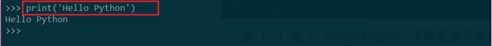
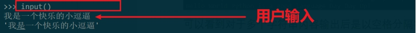
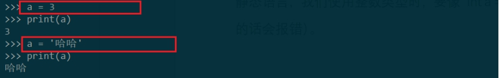
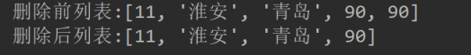
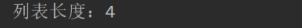

**Python学习笔记**

------

### **1.** Python初识

#### **1.1.** Python简介

#### **1.2.** **版本差异**

### **2.** **环境搭建**

### **3.** **小试牛刀**

我们已经成功搭建了Python环境，下面就可以愉快的学习编写Python代码了。不过我们先不着急一顿猛学基本语法、函数特性等内容，我们可以先简单的手把着手写个Python代码，有个初次感觉，不然都是概念学习比较容易绕进去。

我们以windows环境为例。

#### **3.1.** **交互模式**

**1)** **什么是交互模式**

交互模式即在windows的cmd窗口中输入python后进入的环境，如下：

 

​	我们可以输入python指令或编写代码以运行，其实就和我们在cmd中输入mysql -u -p命令进入mysql交互模式可以写SQL执行MySQL增删该查命令类似。

**2) python代码初试**

一般我们学习某个新的编程语言首先会写的代码是啥？当让是Hello World 啊，那同样的我们在python中输出经典的开场白压压惊。

 

在python中同样的是以引号来标识字符串，同时我们可以发现python对于字符串是不区分单引号或者双引号的：

 

#### **3.2.** **文本模式**

我们在交互模式下输入的命令所见即所得，但是如果我们关闭了命令行窗口呢？代码肯定没了，所以需要以文件形式保存下来。

选择一个磁盘目录，新建一个python文件，例如D盘根目录下hello.py：

 

执行代码文件：

 

可以看到输出了预期内容。

Python的交互模式和直接运行.py文件有什么区别呢？

* 直接输入python进入交互模式，相当于启动了Python解释器，但是等待你一行一行地输入源代码，每输入一行就执行一行。

* 直接运行.py文件相当于启动了Python解释器，然后一次性把.py文件的源代码给执行了，你是没有机会以交互的方式输入源代码的。

### **4.** Python基础

#### **4.1.** **基本语法**

##### 4.1.1. 编码

默认情况下，Python 3 源码文件以 **UTF-8** 编码，所有字符串都是 unicode 字符串。 当然你也可以为源码文件指定不同的编码。

##### 4.1.2. 标识符

* 第一个字符必须是字母表中字母或下划线 _ 。

* 标识符的其他的部分由字母、数字和下划线组成。

* 标识符对大小写敏感。

在 Python 3 中，非 ASCII 标识符也是允许的了。 

##### **4.1.3.** **保留字**

保留字即关键字，我们不能把它们用作任何标识符名称。Python 的标准库提供了一个 keyword 模块，可以输出当前版本的所有关键字：

 

##### 4.1.4. 格式

 

 

##### **4.1.5.** **注释**

Python中单行注释以 **#** 开头：

 

多行注释可以用多个 # 号，还有 ''' 和 """：

 

##### **4.1.6.** **大**小写

Python程序是大小写敏感的。

##### **4.1.7.** **行与缩进**

python使用缩进来表示代码块，每一行都是一个语句，当语句以冒号:结尾时，缩进的语句视为代码块。不需要使用大括号 {} 。

 

 

如上示例因为第5行冒号，所以下面缩进的第6、7行为一代码块；

如果缩进不一致，会导致错误，例如：

 

 

第10行和第9行理论上是同一代码块，但是因为缩进不一致导致不能匹配，报错。

缩进的空格数是可变的，但是同一个代码块的语句必须包含相同的缩进空格数

##### **4.1.8.** **多行**语句

Python语句一行为一语句，但是如果内容过长一行写不完非要占用多行怎么办呢？我们可以使用反斜杠(\)来实现多行语句。

 

 

在 [], {}, 或 () 中的多行语句，不需要使用反斜杠(\)，例如：

 

#### **4.2.** **输入输出**

##### **4.2.1.** **输出**

 

通过print()函数我们可以直接输出内容到屏幕。

print() 函数也可以输出多个字符串，用逗号间隔即可：

 

可以看到对于多个字符串内容输出后是以空格分隔字符串的。

print()函数也可以直接输出数值计算结果：

 

##### **4.2.2.** **输入**

 

input()函数可让用户录入内容，当执行input()函数的时候，程序会等待用户输入，输入完成后，在交互模式下，会直接回显用户输入的内容。

可以输入数值运算吗？

 

可以证明input()对于录入的内容都是按照字符串处理的。

input()输入函数对于输入的内容可以赋值给一个变量：

 

这里我们将输入的字符串值“小明”赋值给变量name，然后输出打印变量name，发现输出值内容正是符合预期的变量值。

#### **4.3.** **常量变量**

##### 4.3.1. 常量

所谓常量就是不能变的变量，比如常用的数学常数π就是一个常量。在Python中，通常用全部大写的变量名表示常量：

 

其实常量本质上还是变量，只不过我们约定用全大写字母表示这是常量罢了，我们依然可以修改它的值，这点Python和其它语言例如Java是不太一样的，Java中可以使用final等修饰符使字符串常量值不可更改，但是Python没有此种机制。

##### 4.3.2. 变量

示例：

```python
# 直接用等号赋值定义变量  
name = 'xiaoming is a boy'  
print(name)  
  
# 变量可以重新赋值  
name = 'today is a good day'  
print(name)  
  
# 变量甚至可以修改类型  
name = 1 + 2  
print(name)  
```

说明:

* 变量，直白点就是存储值的对象，并且值可以更改。变量不仅可以是数字，还可以是任意数据类型。

* 变量在程序中就是用一个变量名表示了，变量名必须是大小写英文、数字和_的组合，且不能用数字开头。具体变量命名规范：

 

* Python 中的变量不需要声明。每个变量在使用前都必须赋值，变量赋值以后该变量才会被创建。在 Python 中，变量就是变量，它没有类型，我们所说的"类型"是变量所指的内存中对象的类型。

* 等号（=）用来给变量赋值。

* 等号（=）运算符左边是一个变量名,等号（=）运算符右边是存储在变量中的值。

 

多个变量赋值：可以一次为多个变量赋值，也可以对照位置赋值：

 

Python中变量可以多次赋值，并且类型可以不一样，这是因为Python为动态语言（**动态语言**即变量使用不需要预先声明变量类型，且可以随意更改类型，例如JavaScript，我们声明变量直接用 var a = 3这种形式，而且可以重新赋值其它类型值；与之相对的是**静态语言**，静态语言在定义变量时必须指定变量类型，如果赋值的时候类型不匹配，就会报错，例如Java就是静态语言，我们使用整数类型时，要像 int a = 10 这样先声明类型，而且如果我们赋值字符串的话会报错）。

 

#### **4.4.** **数据类型**

Python3 中有六个标准的数据类型：

* Number（数字）

* String（字符串）

* List（列表）

* Tuple（元组）

* Set（集合）

* Dictionary（字典）

Python3 的六个标准数据类型中：

* 不可变数据（3 个）：Number（数字）、String（字符串）、Tuple（元组）；

* 可变数据（3 个）：List（列表）、Dictionary（字典）、Set（集合）。

##### 4.4.1. Number（数字）

```python
# 整数：加减乘除  
print(1 + 2)  
print(1 * 2)  
print(1 - 2)  
print(1 / 2)  
print(2 / 3)  
  
# 两个个乘号表示乘方  
print(2 ** 3)  
# 三个以上乘号没有这种，报错  
# print(2 *** 3)  
  
# 支持次序运算  
print(2 * (3 + 1))  
  
# 浮点数：带小数点的数字都是浮点数  
# 需要注意浮点数运算表示不精确问题  
print(0.1 + 0.2)  
print(0.1 - 0.2)  
print(0.1 * 0.2)  
print(0.1 / 0.2)  
  
# 字符拼接数字  
# print("小明今年" + 7 + "岁") 会报错，因为无法识别7是作为字符的，直接数字运算，所以报错  
print("小明今年" + str(7) + "岁")  
print("小明今年" + str(3 + 5) + "岁")  
```

运行结果：

 

##### 4.4.2. String**（字符串）**

```python
# 直接用引号表示的内容就是字符串  
address = '中国江苏'  
print(address)  
# 单引号、双引号都可以表示字符串  
address = "中国南京"  
print(address)  
  
# 如果要在字符串中表示字符串，需要注意和语法定义的字符表示相反  
address = '江苏是"东部沿海省份"'  
print(address)  
address = "江苏是'东部沿海省份'"  
print(address)  
  
# 首字母大写  
message = 'nanjing is a city'  
print(message.title())  
  
# 字符全部大写  
print(message.upper())  
# 字符全部小写  
print(message.lower())  
  
# 字符串拼接  
message1 = 'nanjing is a city'  
message2 = 'huaian is also a city'  
print(message1 + " , " + message2)  
  
# 制表符  
message = '\tnanjing is a city'  
print(message)  
# 换行  
message = 'nanjing \n\tis a city'  
print(message)  
 
# 去掉左侧空格  
message = '  nanjing is a city'  
print(message.lstrip())  
# 去掉右侧空格  
message = '  nanjing is a city  '  
print(message.rstrip())  
# 去掉左右两侧空格  
message = '  nanjing is a city  '  
print(message.strip())  
print(message)  
```

运行结果：

 

##### **4.4.3.** **List（列表）**

**1)** **列表概念**

Python中列表指由一系列按特定顺序排列的元素组成的对象，用方括号[ ]表示，并用逗号分隔其中的元素，元素之间可无任何关系。例如 [ ‘xiaoming’, ‘xiaohong’ ]

```python
# 列表 List  
names = ['xiaoming', 'xiaohong']  
print(names) 
```

 

**2)** **访问列表元素**

列表是有序集合，可使用索引访问对应位置元素，索引从0开始，向后依次递增；末尾元素索引可以用 -1表示，倒数第二个-2，以此类推……

```python
# 访问列表元素  
citys = ['南京', '杭州', '厦门', '青岛']  
print(citys[0])  
print(citys[1])  
print(citys[-1])  
print(citys[-2])  
print("我最喜欢的城市：" + citys[-1])  
  
# 数字列表  
nums = [11, 2, 36, 90]  
# print("我最喜欢的数字：" + nums[1]) 报错  
print("我最喜欢的数字：" + str(nums[1]))  
  
# 任意类型元素组成的列表  
members = [11, "淮安", '青岛', 90]  
print("第2个元素：" + members[1])  
```

 

**3)** **修改元素值**

直接指定索引元素，设置新值即可

```python
# 修改元素值  
members = [11, "淮安", '青岛', 90]  
members[0] = 'xiao'  
print(members)  
```

 

**4)** **添加元素值**

Ø 列表末尾添加 ：append

```python
## 末尾添加  
members = [11, "淮安", '青岛', 90]  
members.append('红')  
print(members)  
## 空列表末尾添加  
members = []  
members.append('红')  
members.append(12)  
print(members)  
```

 

Ø 指定索引位置添加：insert

指定索引位置添加元素后，后续的元素后移

```python
## 指定位置添加  
members = [11, "淮安", '青岛', 90]  
members.insert(1, 50)  
print(members)  
```

 

**5)** **删除元素**

Ø del删除

直接删除元素，获取不到被删除元素是哪个

```python
## 直接删除  
members = [11, "淮安", '青岛', 90]  
print(members)  
del members[0]  
print(members)  
```

 

Ø pop删除

删除元素后，可以返回删除的元素；pop()指定索引则删除指定位置上元素，不指定索引则删除末尾元素。

```python
## pop删除  
members = [11, "淮安", '青岛', 90]  
print("删除前列表:" + str(members))  
item = members.pop()  
print("被删除元素：" + str(item))  
print("删除后列表:" + str(members))  
  
## pop指定索引删除  
members = [11, "淮安", '青岛', 90]  
print("删除前列表:" + str(members))  
item = members.pop(2)  
print("被删除元素：" + str(item))  
print("删除后列表:" + str(members))  
```

 

Ø 根据值删除：remove

```python
## 根据值删除  
members = [11, "淮安", '青岛', 90]  
print("删除前列表:" + str(members))  
members.remove(90)  
print("删除后列表:" + str(members)) 
```

 

remove只删除第一个出现的值，如果列表中有多个相同的要删除的值，后面的会继续保留

```python
## 根据值删除  
members = [11, "淮安", '青岛', 90, 90]  
print("删除前列表:" + str(members))  
members.remove(90)  
print("删除后列表:" + str(members))  
```

 

**6)** **列表排序**

Ø 按照首字母排序：sort() , 改变原有列表结构

```python
# 排序列表  
## 按照首字母正排序  
members = ['windows', 'Apple', 'oracle', 'ibm']  
members.sort()  
print(members)  
## 按照首字母反排序  
members = ['windows', 'Apple', 'oracle', 'ibm']  
members.sort(reverse=True)  
print(members)  
```

 

Ø 临时排序：不改变列表本身  

```python
## 临时排序：不改变列表本身  
members = ['windows', 'Apple', 'oracle', 'ibm']  
members2 = sorted(members)  
members3 = sorted(members, reverse=True)  
print("\n排序后内容：" + str(members2))  
print("倒排序后内容：" + str(members3))  
print("原有列表：" + str(members))  
```

 

也支持数字排序

```python
## 数字排序  
members = [23, 1, 78, 13]  
members2 = sorted(members)  
print("\n排序后内容：" + str(members2))  
print("原有列表：" + str(members))
```

 

**7)** **反转列表：reverse()改变列表结构**

```python
# 反转列表  
members = [11, "淮安", '青岛', 90]  
members.reverse()  
print(members)  
members.reverse()  
print(members)  
```

 

**8)** **获取列表长度：len**()

```python
# 确定列表长度  
members = [11, "淮安", '青岛', 90]  
print("列表长度：" + str(len(members))) 
```

 

##### 4.4.4. Tuple**（元组）**

##### 4.4.5. Set**（集合）**

##### 4.4.6. Dictionary**（字典）**

##### **4.4.7.** **布尔值**

##### 4.4.8. 空值

 